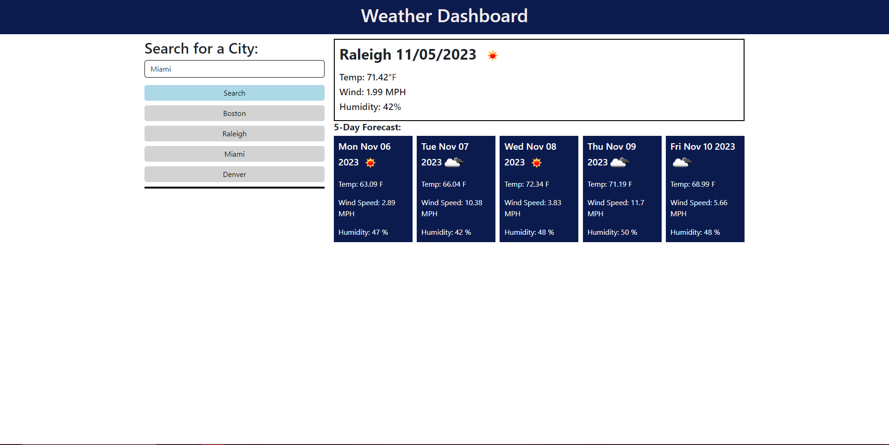

# green-forest

## Description
This weather app uses the OpenWeather API to gather information about the weather and report back the current and 5-day forecast. You can also search previous cities by clicking on them in the history section to display that forecast again.

## Feature APIs
OpenWeater API - https://openweathermap.org/api

## Link and Screenshot
WebPage: https://laude-noctis.github.io/green-forest/
  
